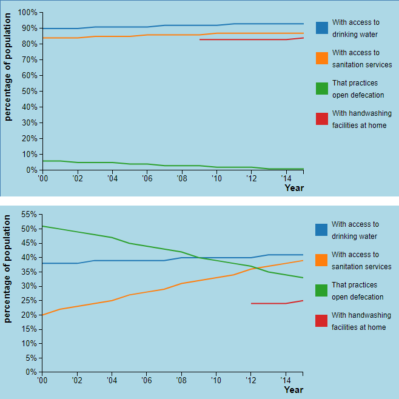

# Dag 1

**Figuur 1. Mijn pagina ziet er nu zo uit:**

###Belangrijke beslissingen

- De verdeling van de pagina wordt als volgt:
	- Linksboven komt de lijngrafiek (lightblauw blok)
	- Linksonder komt de sunburst (lichtgrijs blok)
	- Rechts komt de scatterplot (wit blok)
	- Ik twijfel nog of de scatterplot wat smaller moet en de andere 
	twee breder.

- Als ik nog een wereldkaart wil maken, ga ik die nog boven deze drie 
visualisaties laten zien. Als dat lukt, wil ik dan graag dat je eerst alleen 
de kaart ziet en als je dan op een land klikt, dat de pagina dan automatisch 
naar de drie visualisaties wordt gescrolld. 

###Moeilijkheden

Ik heb nog een beetje moeite met het maken van de grafiek. Daar kom ik wel uit, 
maar het kost me nu al wel heel veel tijd. Het wordt ook nog even lastig om te 
bedenken hoe ik het ga doen met missende data. Voor bepaalde landen mist 
bijvoorbeeld één variabele helemaal en voor veel landen missen er in bepaalde 
jaren ook een paar variabelen. 

###Morgen

Morgen ga ik als eerste mijn grafiek afmaken, daarna ga ik beginnen met het 
opzetten van mijn scatterplot. 

# Dag 2

**Figuur 2. Mijn pagina ziet er nu zo uit:**

### Belangrijke beslissingen
- Ik heb een beslissing gemaakt over wat ik doe met de missende data in mijn 
lijngrafiek.
	- Als data voor één categorie mist voor elk jaar, dan laat ik de hele lijn 
	weg en dan ga ik naast de grafiek met tekst aangeven dat deze variabele 
	mist voor het desbetreffende land.
	- Als data in een categorie mist voor een paar jaren, had ik twee opties om 
	uit te kiezen. 
		- Optie 1: Ik geef de missende values een waarde van 0. Hoe dat eruit 
		ziet, kun je zien in figuur 3.
		- Optie 2: Ik teken de grafiek tot aan / vanaf waar ik wel waarden van 
		heb. Hoe dat eruit ziet, kun je zien in figuur 4.
	- Ik heb gekozen voor optie 2, omdat optie 1 eigenlijk gewoon verkeerde 
	informatie geeft. Ik weet niet wat de waarde was in deze jaren, dus ik kan 
	het ook niet weergeven in mijn grafiek.

**Figuur 3. Missende data optie 1: in deze grafiek mist data voor 'With 
handwashing facilities at home' in de jaren 2000 tm 2004.**

**Figuur 4. Missende data optie 2: in deze grafiek mist data voor 'With 
handwashing facilities at home' in de jaren 2000 tm 2004.**

- Ook heb ik een beslissing gemaakt over het domein van de y-as van mijn 
grafiek. De opties zijn als volgt:
	- Elke keer bij het aanklikken van een nieuw land worden de lijnen geupdate 
	en ook het domein. Want de maximale y-waarde van de variabelen is niet voor 
	elk land hetzelfde. Zie in figuur 5 dan het verschil in grafieken tussen 
	twee landen.
	- Elke keer bij het aanklikken van een nieuw land worden de lijnen geupdate 
	en het domein niet. Want ook al is de maximale y-waarde van de variabelen 
	misschien niet gelijk, zo is het juist makkelijker om in één oogopslag het 
	verschil tussen verschillende landen te zien. Zie in figuur 6 dan het 
	verschil in grafieken tussen twee landen.
	- Ik heb gekozen voor optie 2, omdat ik het belangrijk vind dat gebruikers 
	zo goed het verschil kunnen zien tussen de landen wanneer ze van land 
	wisselen.

**Figuur 5. Domein optie 1: data van Algerije (boven) vergeleken met Angola 
(onder)**

**Figuur 6. Domein optie 2: data van Algerije (boven) vergeleken met Angola 
(onder)**

### Moeilijkheden

De vorige keer met het maken van een lijngrafiek vond ik het erg lastig om 
de interactivteit goed te krijgen. Dit gaat dus nog iets lastigs worden, 
maar voor nu ga ik mijn grafiek even statisch laten, want de deadline voor 
vrijdag is dat alle visualisaties statisch af zijn.

### Morgen

Morgen ga ik als eerste beginnen met het maken van de scatterplot.

# Dag 3

**Figuur 3.1. Mijn pagina ziet er nu zo uit:**

### Belangrijke beslissingen

Vandaag ben ik vooral bezig geweest met het transformeren van de data en het 
maken van de scatterplot. 
Hier zijn verder niet echt belangrijke beslissingen bij betrokken geweest.

### Morgen

Morgen ga ik de checkboxes maken voor de scatterplot. Hierbij komt ook kijken 
dat ik moet beslissen welke variabelen de gebruiker allemaal met elkaar kan 
vergelijken. Ook ga ik kijken hoe het maken van een sunburst moet en beginnen 
met het transformeren van mijn data voor de sunburst. 

### Moeilijkheden

- Voor de variabelen die gebruikers met elkaar willen vergelijken, wil ik niet 
alleen hoofdcategorieën, maar ook subcategorieën van ziektes gebruiken. Maar 
subcategorieën worden anders aangeroepen in de data dan hoofdcategorieën (omdat 
subcategorieën twee lagen diep gaat en bij hoofdcategorieën gaat het maar 1 
laag diep, dus dat wordt waarschijnlijk een beetje lastig met het aanroepen 
ervan. 
- Ik weet nog niet hoe moeilijk het is om een sunburst te maken, maar ik 
verwacht dat het uitzoeken hiervan en het transformeren van de data me erg veel 
tijd en moeite gaat kosten. 

# Dag 5

**Figuur 4.1. Mijn pagina ziet er nu zo uit:**

### Interactiviteit vooruitgang

- Bij het drukken op de knoppen voor de variabelen van de x- en / of y-as in de 
scatterplot, wordt de grafiek geupdatet zodat de nieuwe variabelen worden laten 
zien.
- Ook verandert de kleur van de checkbox die net is aangedrukt naar blauw. De 
checkbox die hiervoor blauw was, verandert weer naar wit. In het plaatje zijn 
worden dus "Percentage of population with access to drinking water" en "Deaths 
per 100 000 population to Neoplasms" tegen elkaar uitgezet in de grafiek.

### Belangrijke beslissingen

- Twee belangrijke beslissingen van vandaag gaan over de variabelen die met 
elkaar kunnen worden vergeleken in de scatterplot:
	- Op de x-as wil ik graag dat, naast de hygiene variabelen, ook BMI en 
	levensverwachting kunnen worden gekozen. Ik heb al data gevonden, maar nog 
	niet geimplementeerd dus het kan zijn dat ik toch nog ergens tegenaan loop 
	met de data, bijvoorbeeld dat de landnamen allemaal niet overeenkomen met 
	de data die ik al heb. Maar dit verwacht ik niet. 
	- Op de y-as wil ik graag dat de volgende ziektes kunnen worden gekozen 
	als doodsoorzaak: 
		- Certain infectious and parasitic diseases
		- Diseases of the circulatory system
		- Mental and behavioural disorders (of: Alzheimer and other dementias)
		- Diseases of the digestive system (of: diseases of the liver)
		- Pregnancy childbirth and the puerperium
		- Neoplasms
		- Endocrine nutritional and metabolic diseases (of: malnutrition)
		- Diseases of the nervous system
		- Diseases of the respiratory system (of: tuberculose)
		- External causes of morbidity and mortality (of: intentional 
		self-harm en: traffic accidents)
	- Achter sommige variabelen staat (of: ), hier wil ik eigenlijk een 
	subcategorie (de naam achter of: ) als optie geven ipv de hoofdcategorie 
	die nu aangegeven staat. Dit is lastig omdat de subcategorieën een laag 
	dieper in de data staan dan de hoofdcategorieën, dus ik moet nog even 
	kijken of dat me lukt.
- Nog een belangrijke beslissing die ik heb gemaakt is dat ik toch de as van 
mijn lijngrafiek ga updaten wanneer een nieuw land wordt gekozen (zie dag 2 
voor eerdere beslissing hierover). Dit heb ik gedaan omdat ik denk dat het toch 
toevoeging heeft als je ziet van waar tot waar de as loopt, dit geeft ook al 
erg veel inzicht. Ook kun je de lijnen beter zien als het domein wat kleiner is.

### Maandag

Maandag ga ik:
- Beginnen met de interactiviteit van de lijngrafiek en het 
updaten van de lijngrafiek bij het kiezen van een land. 
- De sunburst maken. Hier ben ik vandaag al mee begonnen, maar ik liep heel erg 
vast en we konden vandaag geen vragen stellen. Vandaar dat ik verder ben 
gegaan met andere dingen, zodat ik maandag vanaf 13.00 uur hier weer mee verder 
kan. 
- De dots in de scatterplot kleuren op basis van werelddeel. Aangezien ik 
misschien geen wereldkaart meer ga maken, kan ik zo mooi toch een beetje 
de geografische spreiding laten zien.
- Een beslissing maken over de checkboxen. Het is nu erg druk op mijn pagina 
en er zouden eigenlijk ook geen checkboxen verder meer bij kunnen (en ook de 
legenda voor de werelddelen zal moeilijk worden als het zo blijft). Misschien 
dat ik ervoor kies om toch een dropdown menu te gebruiken voor beide assen. 
Moeilijk hiermee was wel dat in een dropdown menu de opties niet op meerdere 
regels weergegeven kunnen worden. Dat wordt in het geval van de y-as dus wel 
erg lastig. Maar misschien dat ik dan alleen één woord kan opschrijven en dan 
gebruik kan maken van een tooltip.

