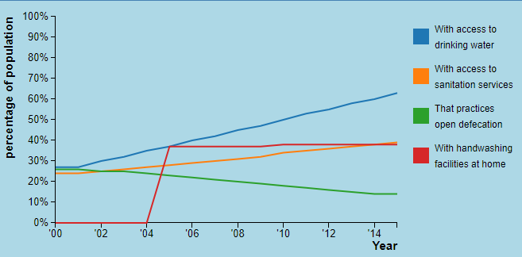

# Dag 1

**Figuur 1. Mijn pagina ziet er nu zo uit:**

###Belangrijke beslissingen

- De verdeling van de pagina wordt als volgt:
	- Linksboven komt de lijngrafiek (lightblauw blok)
	- Linksonder komt de sunburst (lichtgrijs blok)
	- Rechts komt de scatterplot (wit blok)
	- Ik twijfel nog of de scatterplot wat smaller moet en de andere 
	twee breder.

- Als ik nog een wereldkaart wil maken, ga ik die nog boven deze drie 
visualisaties laten zien. Als dat lukt, wil ik dan graag dat je eerst alleen 
de kaart ziet en als je dan op een land klikt, dat de pagina dan automatisch 
naar de drie visualisaties wordt gescrolld. 

###Moeilijkheden

Ik heb nog een beetje moeite met het maken van de grafiek. Daar kom ik wel uit, 
maar het kost me nu al wel heel veel tijd. Het wordt ook nog even lastig om te 
bedenken hoe ik het ga doen met missende data. Voor bepaalde landen mist 
bijvoorbeeld één variabele helemaal en voor veel landen missen er in bepaalde 
jaren ook een paar variabelen. 

###Morgen

Morgen ga ik als eerste mijn grafiek afmaken, daarna ga ik beginnen met het 
opzetten van mijn scatterplot. 

# Dag 2

**Figuur 2. Mijn pagina ziet er nu zo uit:**

### Belangrijke beslissingen
- Ik heb een beslissing gemaakt over wat ik doe met de missende data in mijn 
lijngrafiek.
	- Als data voor één categorie mist voor elk jaar, dan laat ik de hele lijn 
	weg en dan ga ik naast de grafiek met tekst aangeven dat deze variabele 
	mist voor het desbetreffende land.
	- Als data in een categorie mist voor een paar jaren, had ik twee opties om 
	uit te kiezen. 
		- Optie 1: Ik geef de missende values een waarde van 0. Hoe dat eruit 
		ziet, kun je zien in figuur 3.
		- Optie 2: Ik teken de grafiek tot aan / vanaf waar ik wel waarden van 
		heb. Hoe dat eruit ziet, kun je zien in figuur 4.
	- Ik heb gekozen voor optie 2, omdat optie 1 eigenlijk gewoon verkeerde 
	informatie geeft. Ik weet niet wat de waarde was in deze jaren, dus ik kan 
	het ook niet weergeven in mijn grafiek.

**Figuur 3. Missende data optie 1: in deze grafiek mist data voor 'With 
handwashing facilities at home' in de jaren 2000 tm 2004.**

**Figuur 4. Missende data optie 2: in deze grafiek mist data voor 'With 
handwashing facilities at home' in de jaren 2000 tm 2004.**

- Ook heb ik een beslissing gemaakt over het domein van de y-as van mijn 
grafiek. De opties zijn als volgt:
	- Elke keer bij het aanklikken van een nieuw land worden de lijnen geupdate 
	en ook het domein. Want de maximale y-waarde van de variabelen is niet voor 
	elk land hetzelfde. Zie in figuur 5 dan het verschil in grafieken tussen 
	twee landen.
	- Elke keer bij het aanklikken van een nieuw land worden de lijnen geupdate 
	en het domein niet. Want ook al is de maximale y-waarde van de variabelen 
	misschien niet gelijk, zo is het juist makkelijker om in één oogopslag het 
	verschil tussen verschillende landen te zien. Zie in figuur 6 dan het 
	verschil in grafieken tussen twee landen.
	- Ik heb gekozen voor optie 2, omdat ik het belangrijk vind dat gebruikers 
	zo goed het verschil kunnen zien tussen de landen wanneer ze van land 
	wisselen.

**Figuur 5. Domein optie 1: data van Algerije (boven) vergeleken met Angola 
(onder)**

**Figuur 6. Domein optie 2: data van Algerije (boven) vergeleken met Angola 
(onder)**

### Moeilijkheden

De vorige keer met het maken van een lijngrafiek vond ik het erg lastig om 
de interactivteit goed te krijgen. Dit gaat dus nog iets lastigs worden, 
maar voor nu ga ik mijn grafiek even statisch laten, want de deadline voor 
vrijdag is dat alle visualisaties statisch af zijn.

### Morgen

Morgen ga ik als eerste beginnen met het maken van de scatterplot.

# Dag 3

**Figuur 3.1. Mijn pagina ziet er nu zo uit:**

### Belangrijke beslissingen

Vandaag ben ik vooral bezig geweest met het transformeren van de data en het 
maken van de scatterplot. 
Hier zijn verder niet echt belangrijke beslissingen bij betrokken geweest.

### Morgen

Morgen ga ik de checkboxes maken voor de scatterplot. Hierbij komt ook kijken 
dat ik moet beslissen welke variabelen de gebruiker allemaal met elkaar kan 
vergelijken. Ook ga ik kijken hoe het maken van een sunburst moet en beginnen 
met het transformeren van mijn data voor de sunburst. 

### Moeilijkheden

- Voor de variabelen die gebruikers met elkaar willen vergelijken, wil ik niet 
alleen hoofdcategorieën, maar ook subcategorieën van ziektes gebruiken. Maar 
subcategorieën worden anders aangeroepen in de data dan hoofdcategorieën (omdat 
subcategorieën twee lagen diep gaat en bij hoofdcategorieën gaat het maar 1 
laag diep, dus dat wordt waarschijnlijk een beetje lastig met het aanroepen 
ervan. 
- Ik weet nog niet hoe moeilijk het is om een sunburst te maken, maar ik 
verwacht dat het uitzoeken hiervan en het transformeren van de data me erg veel 
tijd en moeite gaat kosten. 

# Dag 5

**Figuur 4.1. Mijn pagina ziet er nu zo uit:**

### Interactiviteit vooruitgang

- Bij het drukken op de knoppen voor de variabelen van de x- en / of y-as in de 
scatterplot, wordt de grafiek geupdatet zodat de nieuwe variabelen worden laten 
zien.
- Ook verandert de kleur van de checkbox die net is aangedrukt naar blauw. De 
checkbox die hiervoor blauw was, verandert weer naar wit. In het plaatje zijn 
worden dus "Percentage of population with access to drinking water" en "Deaths 
per 100 000 population to Neoplasms" tegen elkaar uitgezet in de grafiek.

### Belangrijke beslissingen

- Twee belangrijke beslissingen van vandaag gaan over de variabelen die met 
elkaar kunnen worden vergeleken in de scatterplot:
	- Op de x-as wil ik graag dat, naast de hygiene variabelen, ook BMI en 
	levensverwachting kunnen worden gekozen. Ik heb al data gevonden, maar nog 
	niet geimplementeerd dus het kan zijn dat ik toch nog ergens tegenaan loop 
	met de data, bijvoorbeeld dat de landnamen allemaal niet overeenkomen met 
	de data die ik al heb. Maar dit verwacht ik niet. 
	- Op de y-as wil ik graag dat de volgende ziektes kunnen worden gekozen 
	als doodsoorzaak: 
		- Certain infectious and parasitic diseases
		- Diseases of the circulatory system
		- Mental and behavioural disorders (of: Alzheimer and other dementias)
		- Diseases of the digestive system (of: diseases of the liver)
		- Pregnancy childbirth and the puerperium
		- Neoplasms
		- Endocrine nutritional and metabolic diseases (of: malnutrition)
		- Diseases of the nervous system
		- Diseases of the respiratory system (of: tuberculose)
		- External causes of morbidity and mortality (of: intentional 
		self-harm en: traffic accidents)
	- Achter sommige variabelen staat (of: ), hier wil ik eigenlijk een 
	subcategorie (de naam achter of: ) als optie geven ipv de hoofdcategorie 
	die nu aangegeven staat. Dit is lastig omdat de subcategorieën een laag 
	dieper in de data staan dan de hoofdcategorieën, dus ik moet nog even 
	kijken of dat me lukt.
- Nog een belangrijke beslissing die ik heb gemaakt is dat ik toch de as van 
mijn lijngrafiek ga updaten wanneer een nieuw land wordt gekozen (zie dag 2 
voor eerdere beslissing hierover). Dit heb ik gedaan omdat ik denk dat het toch 
toevoeging heeft als je ziet van waar tot waar de as loopt, dit geeft ook al 
erg veel inzicht. Ook kun je de lijnen beter zien als het domein wat kleiner is.

### Moeilijkheden

Tot nu toe liep ik erg vast als ik wilde beginnen aan de sunburst. Dus ik 
verwacht dat hier nog aardig wat tijd in gaat zitten.

### Maandag

Maandag ga ik:
- Beginnen met de interactiviteit van de lijngrafiek en het 
updaten van de lijngrafiek bij het kiezen van een land. 
- De sunburst maken. Hier ben ik vandaag al mee begonnen, maar ik liep heel erg 
vast en we konden vandaag geen vragen stellen. Vandaar dat ik verder ben 
gegaan met andere dingen, zodat ik maandag vanaf 13.00 uur hier weer mee verder 
kan. 
- De dots in de scatterplot kleuren op basis van werelddeel. Aangezien ik 
misschien geen wereldkaart meer ga maken, kan ik zo mooi toch een beetje 
de geografische spreiding laten zien.
- Een beslissing maken over de checkboxen. Het is nu erg druk op mijn pagina 
en er zouden eigenlijk ook geen checkboxen verder meer bij kunnen (en ook de 
legenda voor de werelddelen zal moeilijk worden als het zo blijft). Misschien 
dat ik ervoor kies om toch een dropdown menu te gebruiken voor beide assen. 
Moeilijk hiermee was wel dat in een dropdown menu de opties niet op meerdere 
regels weergegeven kunnen worden. Dat wordt in het geval van de y-as dus wel 
erg lastig. Maar misschien dat ik dan alleen één woord kan opschrijven en dan 
gebruik kan maken van een tooltip.

# Dag 6

### Moeilijkheden

- Vandaag kwam ik erachter dat de dataset waarmee ik mijn lijngrafiek maakte 
heel onhandig was om te gebruiken bij het updaten. Ik ben veel tijd verloren 
met het proberen deze dataset toch te gebruiken maar het was echt erg onhandig. 
Ik had namelijk de data alleen opgedeeld in landen en jaren en niet op 
categorie. De categorie was gewoon één van de keys binnen een jaar. En omdat ik 
per categorie een lijn wil maken, moet ik steeds een nieuwe lijnfunctie 
aanmaken wilde ik steeds een andere categorie selecteren. 

### Belangrijke beslissingen

- Om het probleem van de dataset (hierboven beschreven) op te lossen heb ik 
besloten om mijn dataset opnieuw in te delen, dus op land, categorie en dan pas 
jaar. Dus binnen land 4 categorieën (of soms 3) en dan binnen zo'n categorie 
de naam van de categorie en een array met jaartallen en values.

### Morgen

Morgen ga ik:
- De data voor mijn scatterplot omschrijven
- De lijngrafiek opnieuw maken
- De lijngrafiek update functie maken
- De tooltip voor de lijngrafiek maken

# Dag 7 

**Figuur 7.1. Mijn pagina ziet er nu zou uit:**

### Wat heb ik gedaan?

Vandaag heb ik de data van mijn lijngrafiek herschreven, de lijngrafiek gemaakt 
en de update functie van de lijngrafiek werkend gemaakt. Ook heb ik de data van 
mijn sunburst herschreven en de sunburst gemaakt.

### Belangrijke beslissingen

- Ik ga toch het y.domein van mijn lijngrafiek niet steeds updaten, maar gewoon 
een standaard minimum gebruiken van 60. Omdat het anders toch erg moeilijk was 
om de verschillende landen met elkaar te kunnen vergelijken.
- Met het aanpassen van de data heb ik gelijk de variabele "Percentage of 
population that practices open defecation" veranderd naar "Percentage of 
population that does not practice open defecation." Dit heb ik gedaan omdat bij 
de andere drie variabelen een stijging in het aantal percentage beter was dan 
een daling. Ik wilde graag dat dat in dit geval ook zo is omdat je dan nog 
beter kan vergelijken.

### Moeilijkheden

- Het omschrijven van de lijngrafiek is gelukt, maar er is wel één probleem. 
Ik heb ook de data van de sunburst omgeschreven omdat dit ook handiger bleek 
te zijn voor het maken van de sunburst. Maar het probleem is dat ik de 
scatterplot al eerder heb gemaakt en ik in de combinefunctie van mijn 
scatterplot gebruik maak van de data van de lijngrafiek én van de data van de 
sunburst. Nu gebruik ik dus nog de oude datasets, maar dit is eigenlijk super 
onhandig want op deze manier laadt ik alles dubbel in maar in een ander format. 
- Verder is er een probleem met de sunburst. Ik heb hem eerst in een hele 
aparte html gezet, zodat ik kon kijken of alles goed ging met de data etc en ik 
zeker wist dat ik verder niks kapot zou maken van mijn andere visualisaties. 
Dat ging allemaal goed, maar toen ik hem daarna in de svg voor de sunburst bij 
mijn andere visualisaties zette, deed de zoomfunctie het niet meer goed. Elke 
keer als ik nu op een categorie druk om in te zoomen, klapt hij als het ware in 
en is er niet meer te zien dan een lijntje. Als ik bij 'elements' kijk, dan 
staat er ook dat elk deel een afmeting van '0 x iets' heeft gekregen. 

### Morgen

- Morgen wil ik er proberen achter te komen waarom mijn sunburst zo raar doet 
en dit oplossen.
- Ook wil ik de combine functie van de scatterplot zo omschrijven dat ik de 
twee oude datasets van sunburst en lijngrafiek niet meer apart hoef in te laden. 
- Verder wil ik de tooltip van de lijngrafiek gaan maken (hier was ik nog niet 
aan toegekomen vandaag)

# Dag 8

**Figuur 8.1: Zo ziet mijn pagina er nu uit:**

### Wat heb ik gedaan?

Het probleem van de sunburst is opgelost!! Er stond ergens één komma fout. 
Verder heb ik de tooltip van de lijngrafiek afgemaakt.

### Belangrijke beslissingen

-Ik heb besloten om de tooltip ook te laten staan als de muis niet op het 
scherm is, zodat de tooltip aangeeft welk jaar het huidige jaar is. Dus heeft 
de gebruiker het jaar 2003 gekozen, dan geeft de tooltip de data aan voor het 
jaar 2003 (zie figuur 8.1).

### Morgen

- Morgen ga ik de data van de scatterplot herschrijven (wat ik eerder al van 
plan was maar het kwam er steeds niet van). 
	- Ik ga dan ook BMI, life expectancy en werelddeel toevoegen zodat ik de 
	kleur van de dots kan indelen op werelddeel!

# Dag 9

**Figuur 9.1: Zo ziet mijn pagina er nu uit:**

### Wat heb ik gedaan?

De data van de scatterplot is nu ook helemaal omgezet. Ik heb de werelddelen 
toegevoegd, maar nog geen legenda zoals je ziet in figuur 9.1. Ook heb ik de 
update functie van de sunburst gemaakt. 

### Belangrijke beslissingen

- Ik ga life expectancy en BMI alleen nog toevoegen als ik genoeg tijd heb. Dit 
is geen onderdeel van mijn MVP, maar het lijkt me wel nog steeds erg leuk dus 
hopelijk kom ik er wel aan toe.
- In de werkgroep heb ik als tip gekregen om een searchbalk van bootstrap toe 
te voegen waardoor je kan selecteren op land en dan een land kan aanklikken 
zodat de lijngrafiek en de sunburst worden geupdate. Dat ga ik dus nog doen.

### Moeilijkheden

- Ik kwam er net achter dat na het updaten van de sunburst, de verhoudingen van 
de categorieën niet meer kloppen. De data op de tooltip klopt wel, maar de 
grootte van elk balkje nog niet. Dat zal dus iets zijn in mijn updatefunctie 
maar daar moet ik nog even naar kijken
- Ik heb nog geen timeslider gemaakt en dat moet ik wel hebben voor mijn MVP!!! 
Dus dat moet ik nog snel gaan doen!

### Morgen

Morgen ga ik beginnen met het maken van een timeslider en proberen het probleem 
van de sunburst oplossen.

# Dag 10

### Wat heb ik gedaan?

- Vandaag heb ik een timeslider gemaakt, dat was eigenlijk makkelijker dan 
gedacht. Dat kwam denk ik omdat ik heel makkelijk de updatefuncties die ik al 
had ook weer gewoon aan kon roepen met de timeslider, maar dan als argument een 
ander jaar mee te geven in plaats van een ander land. 
- Het is ook gelukt om het probleem van de sunburst op te lossen! Dat is fijn. 
Het kwam door de asynchroniteit van javascript tijdens het updaten: ik 
was al dingen aan het toevoegen terwijl ik intussen ook nog wat verwijderde dus 
daardoor klopten sommige dingen niet meer.
- Ik heb een legenda gemaakt voor bij mijn sunburst, die update wanneer je een 
ander land, een ander jaar of een andere categorie (zoom) aanklikt.

### Moeilijkheden

Ik loop eigenlijk nergens tegen aan op het moment! Ik ben heel blij dat het 
probleem met de sunburst is opgelost.

### Belangrijke beslissingen 

- Ik heb besloten om bij mijn sunburst in de legenda alleen de eerste 10 
categorieën te laten zien. Dit heb ik gedaan omdat de namen van de categorieën 
nogal lang zijn en de legenda anders erg klein wordt. Verder zijn de eerste 10 
categorieën ook de grootste categorieën, dus het meest interessant. De rest van 
de categorieën zijn meestal erg klein. De tooltip is wel aanwezig voor alle 
categorieën, dus er is nog steeds informatie aanwezig voor de gebruiker. 

### Maandag

- Maandag ga ik een dropdown menu maken om een land te kiezen, want nu kun je 
de landen alleen kiezen vanuit de scatterplot en je alleen zoeken op 
werelddeel (kleur geeft werelddeel aan) en met een dropdown kun je ook op naam 
zoeken. Ik wil ook met zo'n zoekbalkje doen als dat lukt.
- Ook wil ik kleurenfuncties gaan maken voor mijn sunburst, zodat elke categorie 
verschillende tinten van dezelfde kleur laat zien. Nu zitten alle kleuren door 
elkaar en dat vind ik storend en onduidelijk. 
- Ik moet ook een legenda gaan maken van de werelddelen bij de scatterplot. 

# Dag 11

### Wat heb ik gedaan?

- Ik heb een dropdown menu gemaakt om een land te kiezen, maar het is me niet 
gelukt om een zoekbalkje toe te voegen. Daarom heb ik de landen op alfabetische 
volgorde gezet, dan is dat zoekbalkje niet meer nodig.
- Ik ben ook bezig geweest met het beter indelen van mijn pagina, ik heb 
bijvoorbeeld een titel toegevoegd die steeds aangeeft welk land en welk jaar 
er is geselecteerd en die het ook aangeeft als er geen data beschikbaar is 
voor de geselecteerde combinatie.
- Van de data over doodsoorzaken had ik tot vandaag alleen maar de jaren 2000 
tm 2005 toegevoegd. Vandaag heb ik ook de jaren 2006 tm 2015 toegevoegd.

### Moeilijkheden

Ik merk dat ik nog een beetje moet wennen aan dingen als bootstrap en alle svg's 
en het indelen van de pagina enzo. Ik had vanaf het begin al drie svg's voor 
mijn drie visualisaties, maar nu ik weer dingen wil veranderen is het wel erg 
veel gedoe. Goed om even te bedenken dat hier nog wel veel tijd in zal gaan 
zitten en dat ik er dus genoeg tijd voor moet uittrekken.

### Morgen

- De kleurenfunctie van de sunburst moet ik morgen gaan maken, want daar ben ik 
vandaag helaas niet aan toegekomen. 
- Ook zal ik dan gaan kijken naar mijn stijl 
en alvast de eerste keer door mijn script lopen om dingen aan te passen.

# Dag 12

### Wat heb ik gedaan?

- De kleurenfuncties van de sunburst zijn af! Ik vind het best mooi geworden. 
De kleuren passen nu ook wat beter bij elkaar. Ik heb nu ook de legenda 
interactief gemaakt met de sunburst (als je over een categorie heen gaat licht 
die hele categorie in de sunburst helemaal op etc) 
- Ik heb mooiere tooltips toegevoegd in de scatterplot en de sunburst, ik had 
al een soort tooltips maar die waren alleen voor tijdelijk. 

### Morgen

- Morgen ga ik als eerste kijken naar mijn stijl. Ik merk dat ik heel graag 
nog allemaal leuke dingen wil doen zoals die BMI toevoegen en extra andere 
functies toevoegen, maar die stijl is natuurlijk nu even belangrijker dus daar 
ga ik morgen naar kijken. En dat houdt vooral heel erg in dingen weggooien die 
ik niet meer gebruik (oude bestanden en functies) en de data, javascript files, 
css files, html files en data processing files in verschillende mappen opdelen! 
