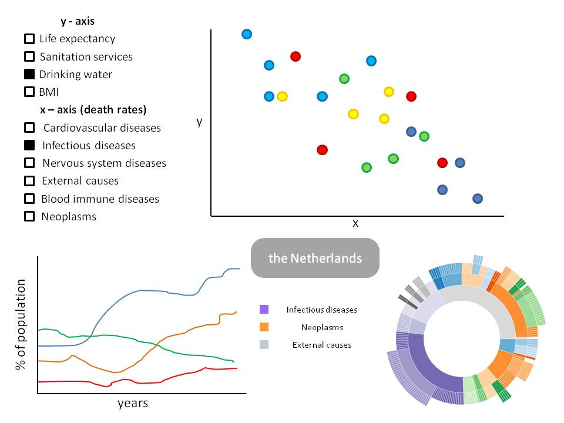

# Project proposal worldwide health and hygiene

**This document contains the proposal for my Porgrammeerproject.**

Name: Eline Rietdijk

Studentnumber: 10811834

Course: Programming Project (dataprocessing)

Goal of this project: creating awareness of the importance of hygiene for health.

## Problem statement
There is an enourmous difference in life expectancy between developing countries and other countries, like the Netherlands. 
Not only life expectancy is different but also the incidence of diseases differs a lot between different countries. 
In the Netherlands, for example, the incidence of cholera is very low. On the other hand, the incidence of cancer is higher in the Netherlands than in most developing countries.
To increase life expactancy and health in developing countries, it is important to understand where these big differences come from. 

## Solution

**Visualisations**

To understand where the big differences in life expectancy and disease incidence come from, I will create a website containing 3 or 4 interacting visualisations showing components that (may) influence health:
- (MVP) scatterplot: in this scatterplot, each point will correspond data from one country. On both axes, different variables can be displayed. The options for the two axes are:
	- x-axis: development variables (specified in DESIGN.md)
	- y-axis: death rates (specified in DESIGN.md)
- (MVP) Hygiene line graph: in this graph, 4 different variables are plotted over the years 2000-2016 for the clicked country: % of population that has access to drinking water facilities, % of population that has access to sanitation facilities, % of population that washes hands with soap, % of population that practices open defecation. 
- (MVP) Diseases sunburst: in this chart, the incidence of different diseases are shown for the clicked country. Alongside the different diseases, there will be a distinction made between communicable and noncommunicable diseases. The reason for this is that hygiene may only affect communicable diseases. 
- (OPTIONAL) Wold Map: each country is displayed in a color corresponding to the life expectancy (darker color = higher life expectancy). Upon clicking one of the countries, a line graph and a barchart will appear (see following points).

**Interactions**

- There will be a time switch to scroll through the years. Upon scrolling though the years, a small indicator will move over each line in the line graph, showing the current year. Also, the sunburst and scatterplot will be updated for the current year. In the line graph, an indicator shows which point on each line correspondents with the current year.
- Hovering: in each visualisation, a hover interactivity will be implemented so that hovering over a datapoint (line, dot, bar or country) shows the exact data values.
- a click function will be present for the scatterplot. A user can choose which variables to show on the axes.
- Upon clicking on one of the dots, the data of the corresponding country will be represented in the sunburst and the linegraph.

**Scetch**

## Prerequisites

**Data sources**

- Hygiene data: http://apps.who.int/gho/data/node.main.WATERSANITATION166?lang=en
- Communicable and noncommunicable diseases: http://apps.who.int/gho/data/node.home

**Transforming data**

The hygiene data does not need transformation, since all components are shown in '% of the population that *has acces to / uses / practices* ....'

The disease data needs to be transformed. All components are shown in 'number of deaths of a certain disease'. I want the data to show death rate, the part of the population that dies of a certain disease, and I will realize that with the following equasion:

death rate = number of deaths / population number

**External components**

d3-tip library
bootstrap library
topojson library

**Related visualisations**

A related visualisation can be found on the WHO website:
https://vizhub.healthdata.org/health-map/nigeria

This map shows health components in Nigeria.

**Hardest parts**

I suspect that it will be hard to keep all these visualisations structured because I want to show a lot of things. Furthermore, I never made a sunburst visualisation before so I think that will be the hardest part

