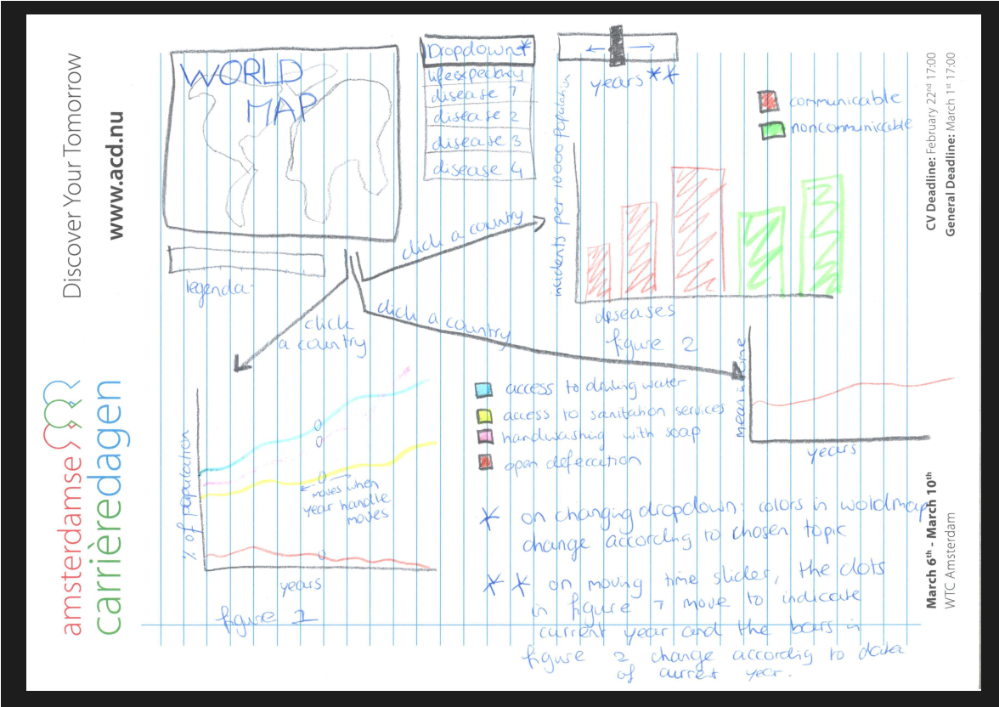

# Project proposal worldwide health and hygiene

**This document contains the proposal for my Porgrammeerproject.**

Name: Eline Rietdijk

Studentnumber: 10811834

Course: Programming Project (dataprocessing)

Goal of this project: creating awareness of the importance of hygiene for health.

## Problem statement
There is an enourmous difference in life expectancy between developing countries and other countries, like the Netherlands. 
Not only life expectancy is different but also the incidence of diseases differs a lot between different countries. 
In the Netherlands, for example, the incidence of cholera is very low. On the other hand, the incidence of cancer is higher in the Netherlands than in most developing countries.
To increase life expactancy and health in developing countries, it is important to understand where these big differences come from. 

## Solution

**Visualisations**

To understand where the big differences in life expectancy and disease incidence come from, I will create a website containing 3 or 4 interacting visualisations showing components that (may) influence health:
- (MVP) Wold Map: each country is displayed in a color corresponding to the life expectancy (darker color = higher life expectancy). Upon clicking one of the countries, a line graph and a barchart will appear (see following points).
- (MVP) Hygiene line graph: in this graph, 4 different variables are plotted over the years 2000-2016 for the clicked country: % of population that has access to drinking water facilities, % of population that has access to sanitation facilities, % of population that washes hands with soap, % of population that practices open defecation. 
- (MVP) Diseases sunburst: in this chart, the incidence of different diseases are shown for the clicked country. Alongside the different diseases, there will be a distinction made between communicable and noncommunicable diseases. The reason for this is that hygiene may only affect communicable diseases. 
- (OPTIONAL) scatterplot: in this scatterplot, each point will correspond data from one country. The first variable is the NBP (reflecting a country's whealth) and the second variable is one of the hygiene variables that are used in the linegraph. 

**Interactions**

- As already stated, on clicking one country on the map, the line graph and the barchart will update with data of the clicked country.
- There will be a time switch to scroll through the years. Upon scrolling though the years, a small indicator will move over each line in the line graph, showing the current year. Also, the barchart, world map and scatterplot will be updated for the current year. 
- Hovering: in each visualisation, a hover interactivity will be implemented so that hovering over a datapoint (line, dot, bar or country) shows the exact data values.
- a dropdown menu will be available for the world map. A user can choose whether the colors on the map represent life expectancy or incidence of one of the documented diseases. 
- (OPTIONAL) a dropdown menu will be available so that the user can choose between seeing the data of one country in two visualisations (sunburst and linegraph) or comparing data of all countries in the scatterplot. With clickboxes, a user can choose which value should be displayed on the x-axis (for example death rates of a certain disease or of a disease group) and which value should be displayed on the y-axis (for example % of population that practices open defecation or average BMI). Each dot in the scatterplot will represent a different country. And more optional, upon clicking one of the dots, the data of the corresponding country will be shown using the line graph and the sunburst again. 

**Scetch**

## Prerequisites

**Data sources**

- Hygiene data: http://apps.who.int/gho/data/node.main.WATERSANITATION166?lang=en
- Communicable and noncommunicable diseases: http://apps.who.int/gho/data/node.home

Some of the data about diseases will have to be transformed, because disease incidence is given per 100 000 population, per 10 000 population or in percentages of the population. 

**External components**

d3-tip library
bootstrap library
topojson library

**Related visualisations**

A related visualisation can be found on the WHO website:
https://vizhub.healthdata.org/health-map/nigeria

This map shows health components in Nigeria.

**Hardest parts**

One of the hardest parts will start with transforming the data, since some data is given in percentages of the population and other data is given in cases per number of population.  

Furthermore, I suspect that it will be hard to keep all these visualisations structured because I want to show a lot of things.

