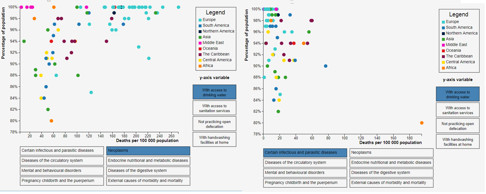
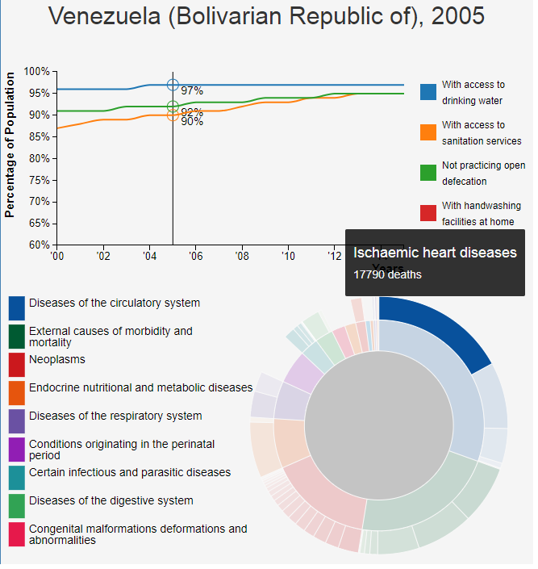

# The link to my website

https://elinerietdijk.github.io/programmeerproject/project/html/

# The link to my product video

https://vimeo.com/253948174

# Worldwide health and hygiene

**This document contains information about my programming project.**

Name: Eline Rietdijk

Studentnumber: 10811834

Course: Programming Project (dataprocessing)

Copyright: The MIT licence

Goal of this project: creating awareness of the importance of hygiene for health.

## Problem statement
There is an enourmous difference in life expectancy between developing countries and other countries, like the Netherlands. 
Not only life expectancy is different but also the incidence of diseases differs a lot between different countries. 
In the Netherlands, for example, the incidence of HIV is very low. On the other hand, the incidence of cancer is higher in the Netherlands than in most developing countries.
To increase life expactancy and health in developing countries, it is important to understand where these big differences come from. 

## Solution

**Visualisations**

To understand where the big differences in life expectancy and disease incidence come from, I have created a website containing 3 interacting visualisations showing components that may influence health:
- (MVP) scatterplot: in this scatterplot, each point will correspond data from one country. On both axes, different variables can be displayed. The options for the two axes are:
	- x-axis: hygiene variables:
		- percentage of population with access to drinking water
		- percentage of population not practicing open defecation
		- percentage of population with access to sanitation services
		- percentage of population with handwashing facilities at home
	- y-axis: death rates for the following diseases:
		- certain infectious and paracitic diseases
		- diseases of the circulatory system
		- mental and behavioural disorders
		- pregnancy, childbirth and the peurperium
		- neoplasms
		- endocrine, nutritional and metabolic diseases
		- diseases of the digestive system
		- external causes of morbidity and mortality
- (MVP) Hygiene line graph: in this graph, the 4 different hygiene variables are plotted over the years 2000-2015 for the clicked country. 
- (MVP) Diseases sunburst: in this chart, the death rates of different diseases are shown for the clicked country.

**Page screenshot showing scatterplot with two different y-variables**

**Interactions**

- Timeslider: on the top of the page, there is a timeslider to scroll through the years 2000 - 2015. Upon scrolling though the years, a small indicator moves over each line in the line graph, showing the value in the current year. Also, the sunburst and scatterplot will be updated for the current year. 
- Countryselector: on the top of the page, the user can choose a country using a dropdown menu. Upon clicking a country, the scatterplot and the sunburst will update, showing data of the clicked country.
- Countries can also be selected by clicking a dot on the scatterplot. The linegraph and sunburst will update, showing data of the country that was represented by the clicked dot.
- Hovering: in each visualisation, a hover interactivity is implemented so that hovering over a datapoint (line, dot or path) shows the exact data values.

**Page screenshot with sunburst tooltip**

## Prerequisites

**Data sources**

- Hygiene data: http://apps.who.int/gho/data/node.main.WATERSANITATION166?lang=en
- Communicable and noncommunicable diseases: http://apps.who.int/gho/data/node.home

**External components**

d3-tip library
d3-queue library
bootstrap library
jQuery library

**Related visualisations**

A related visualisation can be found on the WHO website:
https://vizhub.healthdata.org/health-map/nigeria

This map shows health components in Nigeria.

# Acknowlegdements

**d3 library**

Copyright 2010-2017 Mike Bostock
All rights reserved.

Redistribution and use in source and binary forms, with or without modification,
are permitted provided that the following conditions are met:

* Redistributions of source code must retain the above copyright notice, this
  list of conditions and the following disclaimer.

* Redistributions in binary form must reproduce the above copyright notice,
  this list of conditions and the following disclaimer in the documentation
  and/or other materials provided with the distribution.

* Neither the name of the author nor the names of contributors may be used to
  endorse or promote products derived from this software without specific prior
  written permission.

THIS SOFTWARE IS PROVIDED BY THE COPYRIGHT HOLDERS AND CONTRIBUTORS "AS IS" AND
ANY EXPRESS OR IMPLIED WARRANTIES, INCLUDING, BUT NOT LIMITED TO, THE IMPLIED
WARRANTIES OF MERCHANTABILITY AND FITNESS FOR A PARTICULAR PURPOSE ARE
DISCLAIMED. IN NO EVENT SHALL THE COPYRIGHT OWNER OR CONTRIBUTORS BE LIABLE FOR
ANY DIRECT, INDIRECT, INCIDENTAL, SPECIAL, EXEMPLARY, OR CONSEQUENTIAL DAMAGES
(INCLUDING, BUT NOT LIMITED TO, PROCUREMENT OF SUBSTITUTE GOODS OR SERVICES;
LOSS OF USE, DATA, OR PROFITS; OR BUSINESS INTERRUPTION) HOWEVER CAUSED AND ON
ANY THEORY OF LIABILITY, WHETHER IN CONTRACT, STRICT LIABILITY, OR TORT
(INCLUDING NEGLIGENCE OR OTHERWISE) ARISING IN ANY WAY OUT OF THE USE OF THIS
SOFTWARE, EVEN IF ADVISED OF THE POSSIBILITY OF SUCH DAMAGE.

**jQuery library**

Copyright JS Foundation and other contributors, https://js.foundation/

This software consists of voluntary contributions made by many
individuals. For exact contribution history, see the revision history
available at https://github.com/jquery/jquery

The following license applies to all parts of this software except as
documented below:

====

Permission is hereby granted, free of charge, to any person obtaining
a copy of this software and associated documentation files (the
"Software"), to deal in the Software without restriction, including
without limitation the rights to use, copy, modify, merge, publish,
distribute, sublicense, and/or sell copies of the Software, and to
permit persons to whom the Software is furnished to do so, subject to
the following conditions:

The above copyright notice and this permission notice shall be
included in all copies or substantial portions of the Software.

THE SOFTWARE IS PROVIDED "AS IS", WITHOUT WARRANTY OF ANY KIND,
EXPRESS OR IMPLIED, INCLUDING BUT NOT LIMITED TO THE WARRANTIES OF
MERCHANTABILITY, FITNESS FOR A PARTICULAR PURPOSE AND
NONINFRINGEMENT. IN NO EVENT SHALL THE AUTHORS OR COPYRIGHT HOLDERS BE
LIABLE FOR ANY CLAIM, DAMAGES OR OTHER LIABILITY, WHETHER IN AN ACTION
OF CONTRACT, TORT OR OTHERWISE, ARISING FROM, OUT OF OR IN CONNECTION
WITH THE SOFTWARE OR THE USE OR OTHER DEALINGS IN THE SOFTWARE.

====

All files located in the node_modules and external directories are
externally maintained libraries used by this software which have their
own licenses; we recommend you read them, as their terms may differ from
the terms above.

**Bootstrap library**

The MIT License

Copyright (c) 2012-2017 the AngularUI Team, https://github.com/organizations/angular-ui/teams/291112

Permission is hereby granted, free of charge, to any person obtaining a copy
of this software and associated documentation files (the "Software"), to deal
in the Software without restriction, including without limitation the rights
to use, copy, modify, merge, publish, distribute, sublicense, and/or sell
copies of the Software, and to permit persons to whom the Software is
furnished to do so, subject to the following conditions:

The above copyright notice and this permission notice shall be included in
all copies or substantial portions of the Software.

THE SOFTWARE IS PROVIDED "AS IS", WITHOUT WARRANTY OF ANY KIND, EXPRESS OR
IMPLIED, INCLUDING BUT NOT LIMITED TO THE WARRANTIES OF MERCHANTABILITY,
FITNESS FOR A PARTICULAR PURPOSE AND NONINFRINGEMENT. IN NO EVENT SHALL THE
AUTHORS OR COPYRIGHT HOLDERS BE LIABLE FOR ANY CLAIM, DAMAGES OR OTHER
LIABILITY, WHETHER IN AN ACTION OF CONTRACT, TORT OR OTHERWISE, ARISING FROM,
OUT OF OR IN CONNECTION WITH THE SOFTWARE OR THE USE OR OTHER DEALINGS IN
THE SOFTWARE.