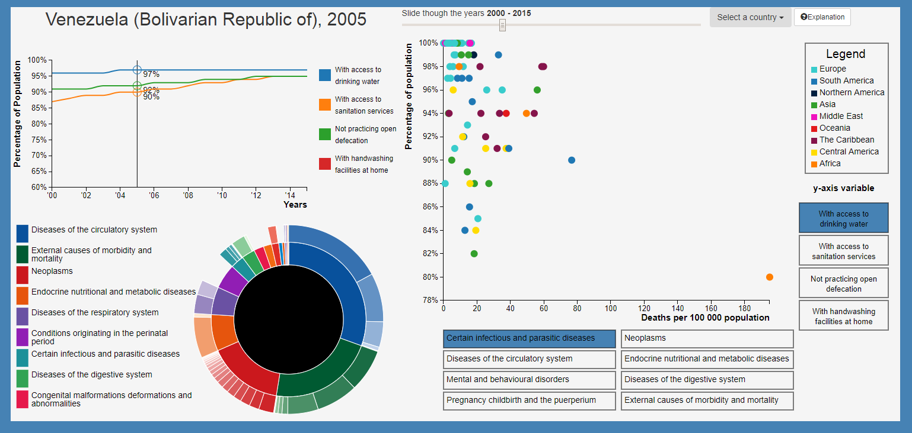

# Korte beschrijving van mijn visualisatie

Mijn website bestaat uit drie visualisaties die allemaal componenten van gezondheid (doodsoorzaken) en hygiene laten zien. Dit heb ik gedaan om duidelijker in beeld te brengen hoe hygiene en gezondheid met elkaar interacteren.

**De lijngrafiek, scatterplot en sunburst op mijn website: **

# Beschrijving van de functionaliteit.

## Het maken van de grafieken

Bij het laden van de pagina wordt als eerste "project.js" aangeroepen. In dit script worden het huidige land en het huidige jaar bepaald, zodat er gelijk data kan worden weergegeven. Het script roept dan de functie "updateTitle" in "helpers.js" aan, zodat duidelijk in beeld komt te staan dat de huidige data wordt weergegeven voor Egypte, 2005. Met dat land en jaar begin ik standaard, hier is geen specifieke reden voor.

Data die wordt ingeladen:
- sunBurstData: doodsoorzaken per jaar per land
- lineGraphData: hygienecomponeneten per jaar per land
- geographics: regio per land en populatie aantal per jaar per land

Vanuit "project.js" worden de "create" functies aangeroepen van de lijngrafiek, de scatterplot en de sunburst. Ik zal de functies in de net genoemde volgorde behandelen

**lijngrafiek**
createGraph wordt dus aangeroepen vanuit "project.js" en bevindt zich in "createLineGraph.js". Deze functie gebruikt de lineGraphData en creeërt eigenlijk het geraamte van de grafiek: de svg, de assen, de legenda, g elementen voor muisbewegingen, de functies voor de lijnen. Dan wordt de functie updateGraph aangeroepen (in hetzelfde script) waardoor de lijnen echt worden getekend. Ook kan vanuit hier het domein van de y-as nog worden aangepast. Dit gebeurt alleen  Steeds wanneer hierna de lijngrafiek geupdate moet worden, wordt alleen nog maar updateGraph aangeroepen. 

Interactiviteit uitleg:
- Wanneer een nieuw land wordt gekozen (verderop in deze file wordt nog uitgelegd hoe gebruikers dat kunnen doen), worden de lijnen geupdate.
- De y-as van de grafiek staat standaard op 60% en wordt alleen aangepast wanneer de minimale y-waarde lager is dan 60%. Dit omdat de gebruiker makkelijker verschillende landen met elkaar kan vergelijken wanneer de y-as steeds hetzelfde blijft.
- Er is een muis interactiviteit functie die bestaat uit een verticale lijn die aangeeft wat het huidige jaar is. Waar de lijnen kruisen met deze lijn wordt de waarde van de lijn op dat punt weergegeven. Wanneer de gebruiker met de muis over de grafiek beweegt, zal de lijn mee bewegen en waarden van andere jaren laten zien. Als de gebruiker weer weg gaat met de muis, laat de lijn weer de data van het huidige jaar zien.

Functies uitleg:
- createGraph: initialiseert belangrijke componenten van de grafiek (zoals breedte en hoogte) en roept createLegenda, createInteractivityGraph en updateGraph aan
- createLegenda: maakt de legenda die bij de grafiek hoort
- createInteractivityGraph: maakt een g element aan dat op muisbewegingen reageert met de interactiviteit die net is beschreven. Roept handleMouseMove aan om de interactiviteit te laten plaatsvinden en roept ook findClosestGraph aan om de dichtstbijzijnde y-waarde voor alle drie de lijnen te vinden bij de x-coordinaten van de muis.
- updateGraph: hier wordt de grafiek echt getekend en eventueel de y-as geupdate. 

**scatterplot**
createScatter wordt dus aangeroepen vanuit "project.js" en bevindt zich in "createScatterPlot.js". Deze functie gebruikt de lineGraphData, geographics én sunBurstData en creeërt het geraamte voor, je raadt het niet, de scatterplot. Vanuit hier worden de assen, de checkboxen voor de variabelen, de legenda en de dropdown om een land te kiezen gecreeërd. 

Functies uitleg:
- createAxes: maakt de assen van de grafiek
- findDomain: zoekt het domein van de data voor de scatterplot
- createCheckBoxes: maakt de vierkanten met de opties voor de x-en y-variabelen. De huidige variablen worden blauw gekleurd zodat duidelijk is wat er op de assen wordt weergegeven
- createCountryselector: hiermee wordt de dropdown menu gemaakt van waaruit landen kunnen worden geselecteerd.
- onclickSelector: de updatefunctie die wordt uitgevoerd wanneer een nieuw land wordt gekozen via het dropdown menu
- updateScatter: hier worden echt de dots gemaakt. Op elke dot kan ook worden gedrukt, dan worden de andere twee visualisaties geupdate voor het land wat die dot representeerde. Telkens wanneer er een nieuw land wordt gekozen (dus via dot click of via het menu), dan wordt in de scatterplot alleen die dot omcirkelt. Soms is de dot van het huidige land niet aanwezig (bijvoorbeeld door afwezige data van de huidige x- en y-variabelen in een bepaald jaar), maar die wordt dan wel weer zichtbaar als bijvoorbeeld de variabelen of het jaartal verandert.
- combineData2: functie die de twee gewenste variabelen met elkaar combineert vanuit de hygieneData en de diseaseData tot de data die gebruikt gaat worden voor de scatterplot. Hier worden ook total population gebruikt omdat de deathrate wordt weergegeven in deaths per 100.000 population en ook wordt hier bij elk land de regio toegevoegd. Deze functie wordt telkens opnieuw aangeroepen vanuit updateScatter wanneer nieuwe variabelen of een nieuw jaar wordt gekozen
- findDiseaseValue en findHygieneValue zijn functies die worden gebruikt vanuit combineData om de variablen te vinden
- createLegendScatter: deze functie wordt vanuit createScatter aangeroepen om de legenda met de regio's aan te maken. Als extra functionaliteit kan de gebruiker met de muis over de legenda bewegen, dan lichten de dots op die bij de landen horen van de regio. 

**sunBurst**

createSun wordt dus aangeroepen vanuit "project.js" en bevindt zich in "createSunBurst.js". Deze functie gebruikt de sunBurstData en creeërt het geraamte voor de sunBurst.

Functies uitleg: 
- createSunColors: maakt de kleurfunctie voor de scatterplot. Elke hoofdcategorie heeft zijn eigen kleur, met een steeds lichtere tint voor elke subcategorie die daaronder valt.
- clickSun: de functie die wordt aangeroepen wanneer een subcategorie wordt aangeklikt
- updateSunBurst: hier worden de paths echt getekend. Deze functie wordt telkens aangeroepen wanneer een nieuw land of een nieuw jaar wordt gekozen. Aan het eind van de updat wordt ook clicksun geroepen, omdat de sunburst anders in een subcategorie blijft tijdens het updaten en dan gaan de categorieën door elkaar.
- updateLegendaSun: deze functie maakt een legenda met de eerste 8 subcategorieën van de huidig aangeklikte hoofdcategorie in de sunburst. Deze wordt dus ook aangeroepen als een nieuwe categorie wordt gekozen.

# Belangijke beslissingen

- Ik heb een beslissing gemaakt over wat ik doe met de missende data in mijn 
lijngrafiek.
	- Als data voor één categorie mist voor elk jaar, dan laat ik de hele lijn 
	weg en dan ga ik naast de grafiek met tekst aangeven dat deze variabele 
	mist voor het desbetreffende land.
	- Als data in een categorie mist voor een paar jaren, had ik twee opties om 
	uit te kiezen. 
		- Optie 1: Ik geef de missende values een waarde van 0. Hoe dat eruit 
		ziet, kun je zien in figuur 3.
		- Optie 2: Ik teken de grafiek tot aan / vanaf waar ik wel waarden van 
		heb. Hoe dat eruit ziet, kun je zien in figuur 4.
	- Ik heb gekozen voor optie 2, omdat optie 1 eigenlijk gewoon verkeerde 
	informatie geeft. Ik weet niet wat de waarde was in deze jaren, dus ik kan 
	het ook niet weergeven in mijn grafiek.

- Twee belangrijke beslissingen van vandaag gaan over de variabelen die met 
elkaar kunnen worden vergeleken in de scatterplot:
	- Op de x-as wil ik graag dat, naast de hygiene variabelen, ook BMI en 
	levensverwachting kunnen worden gekozen. Ik heb al data gevonden, maar nog 
	niet geimplementeerd dus het kan zijn dat ik toch nog ergens tegenaan loop 
	met de data, bijvoorbeeld dat de landnamen allemaal niet overeenkomen met 
	de data die ik al heb. Maar dit verwacht ik niet. 
	- Op de y-as wil ik graag dat de volgende ziektes kunnen worden gekozen 
	als doodsoorzaak: 
		- Certain infectious and parasitic diseases
		- Diseases of the circulatory system
		- Mental and behavioural disorders (of: Alzheimer and other dementias)
		- Diseases of the digestive system (of: diseases of the liver)
		- Pregnancy childbirth and the puerperium
		- Neoplasms
		- Endocrine nutritional and metabolic diseases (of: malnutrition)
		- Diseases of the nervous system
		- Diseases of the respiratory system (of: tuberculose)
		- External causes of morbidity and mortality (of: intentional 
		self-harm en: traffic accidents)
	- Achter sommige variabelen staat (of: ), hier wil ik eigenlijk een 
	subcategorie (de naam achter of: ) als optie geven ipv de hoofdcategorie 
	die nu aangegeven staat. Dit is lastig omdat de subcategorieën een laag 
	dieper in de data staan dan de hoofdcategorieën, dus ik moet nog even 
	kijken of dat me lukt.
- Nog een belangrijke beslissing die ik heb gemaakt is dat ik toch de as van 
mijn lijngrafiek ga updaten wanneer een nieuw land wordt gekozen (zie dag 2 
voor eerdere beslissing hierover). Dit heb ik gedaan omdat ik denk dat het toch 
toevoeging heeft als je ziet van waar tot waar de as loopt, dit geeft ook al 
erg veel inzicht. Ook kun je de lijnen beter zien als het domein wat kleiner is.

- Om het probleem van de dataset (hierboven beschreven) op te lossen heb ik 
besloten om mijn dataset opnieuw in te delen, dus op land, categorie en dan pas 
jaar. Dus binnen land 4 categorieën (of soms 3) en dan binnen zo'n categorie 
de naam van de categorie en een array met jaartallen en values.

- Ik ga toch het y.domein van mijn lijngrafiek niet steeds updaten, maar gewoon 
een standaard minimum gebruiken van 60. Omdat het anders toch erg moeilijk was 
om de verschillende landen met elkaar te kunnen vergelijken.
- Met het aanpassen van de data heb ik gelijk de variabele "Percentage of 
population that practices open defecation" veranderd naar "Percentage of 
population that does not practice open defecation." Dit heb ik gedaan omdat bij 
de andere drie variabelen een stijging in het aantal percentage beter was dan 
een daling. Ik wilde graag dat dat in dit geval ook zo is omdat je dan nog 
beter kan vergelijken.
